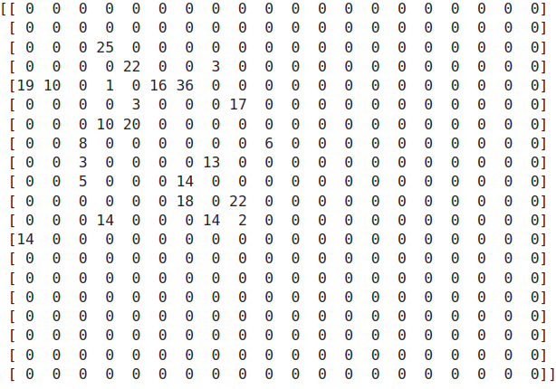

# HPC: SpMV with BCSR form

# Introduction

Sparse Matrix-Vector Multiplication (SpMV) is one of the High-Performance Computing (HPC) problems. In this project, the SpMV problem is practiced with two assumptions: Sparse Matrix is a Symmetric Nine-Banded matrix, and the matrix is in Block Compress Sparse Row Format (BCSR) storage scheme. For HPC, the ITU UHEM supercomputer is used. 

The following section introduces the terminology, techniques, and tools used in this project. Then, experiments and their purposes are defined. In the discussion section, experiment results are discussed considering the architecture. 

# High-Performance Computing (HPC)

High-performance computing (HPC) is one of the groundbreaking discoveries. It constructs many scientific and industrial advancements. Its improvement depends on different fields’ developments: computer architecture (network type, bandwidth, etc.), storage/memory (cache sizes, cache line sizes, etc.), CPU and GPU technology, and programming (cache optimization techniques such as unrolling, indexing, etc.) are some of them. 

## Motivation

According to Phil Colella (2004), there are seven key algorithmic kernels for science and engineering. In other words, these seven numerical methods are important in many scientific computing applications. These key algorithms are called “dwarfs”.These dwarfs are listed as:

1. Dense linear algebra
2. Sparse linear algebra
3. Spectral methods
4. N-body methods
5. Structured grids
6. Unstructured grids
7. MapReduce (ex: Monte Carlo)

Then, the Electrical Engineering and Computer Sciences University of California at Berkeley’s Technical Report (2006) extends the number of dwarfs to 13 by adding the followings:

1. Combinational Logic
2. Graph Traversal
3. Dynamic Programming
4. Back-track/Branch & Bound
5. Graphical Model Inference
6. Finite State Machine

**Why these dwarfs are important for the HPC?** The claim states that these key kernels construct advanced technology in the future. Although we do not know what it is now, If we can find High-Performance solutions for the key algorithms, we can help advance technology ahead now. Because of the claim, solving one of the problems from the list with high-performance computing is significant. 

## TOP500

High-performance computing needs powerful computer systems. These systems are expensive and owning is a status symbol for the owner (In this case, institutions).  The TOP500 list is a great example of this. TOP500 is a project that ranks the 500 most powerful non-distributed computer systems in the world. Institutions compete with each other to be on the list. 

In Turkey, there are two supercomputers that could be able to be on the list:

- TUBITAK ULAKBIM
- UHEM

In order to show how the heat of the race, let's have a look at UHEM’s rank in the TOP500:

| List Date | Rank |
| --- | --- |
| November 2006 | 353 |
| June 2007 | 240 |
| November 2007 | 484 |

Its first rank was 353. With some additions, it could be able to increase its rank in the list. In just a very short time, it lags behind the list. 

## Hardware/Architectural Terminology: TODO

Node

Cores in node

Network Type

Bandwidth

Memory

Network Latency

Memory Latency

Cache Size

Cache Line Size

Bus Size

TLB

## Evaluation Metrics : TODO

Peak Performance

GFlop/sec

Wall clock time

Speed-up

Efficiency

Effective speed-up

Effective Efficiency

## HPC Tools : TODO

### Message Passing Interface (MPI)

### TAU

# Sparse Matrix-Vector Multiplication (SpMV)

This project focuses on Matrix-Vector Multiplication in Sparse Linear Algebra. 

Support Vector Machines, PCA, and component analysis are some of the algorithms which use SpMV operations in Machine Learning. Another usage of SpMV is from Fluid dynamics. This field requires many differential equations and banded matrixes (which are sparse matrixes) are used to solve numerical analysis. 

Since sparse matrix usage is not something new, there are attempts to use it more efficiently. Its compression is one of them. The sparse matrix’s majority elements are zero and do not have any information. So, they do not need any computation. Because the majority part of it does not have any message, the sparse matrix can be stored in compressed form to optimize the storage. There are many compression forms: Compress Sparse Column (CSC), Compress Sparse Row (CSR), and their block forms (Block CSC (BCSC) and Block CSR (BCSR)) are some of them. Since BCSR is used in this project, the next section explains this scheme.

In addition to compression, sparse matrix operation can be simplified if the matrix has some characteristics such as symmetric, diagonalization, or band. For example, if the matrix is upper triangular, its matrix-vector multiplication can be improved by indexing over only half of the matrix. 

## Block Compress Sparse Row (BCSR) Form

Before introducing BCSR, I would like to share this animation which visualizes the CSR form well:

[https://matteding.github.io/2019/04/25/sparse-matrices/#:~:text=be grokked.-,Compressed Sparse Row/Column,-The Compressed](https://matteding.github.io/2019/04/25/sparse-matrices/#:~:text=be%20grokked.-,Compressed%20Sparse%20Row/Column,-The%20Compressed)

BCSR is the compression method of a sparse matrix. It approaches the matrix as nxn dimension block where the matrix dimension is multiple of n. These blocks cover all nonzero values in the matrix. Figure X illustrates the blocks of a random sparse matrix.

It stores the matrix information in three different arrays. These arrays are the following:

- Block values in row order
- Pointer row of the blocks
- Column index of the blocks

TODO: Add/find animation

# Implementation

## Optimization of Symmetric Nine-Banded Sparse Matrix with BCSR

EXAMPLE FIGURE

The problem has the assumption that the matrix is a Symmetric Nine-Banded matrix. This limitation introduces some facilities in the implementation. After observing the matrix in blocked form, the following results can be interpreted: 

- Block dimensions are best suited with 5x5 or 10x10.

Assume chosen block dimension is 5x5. The listed patterns can be interpreted for the matrix in Figure-Y:

*Block Type Pattern:*

- In the first block row, the first block is a symmetric matrix (S). The second block is Lower Triangular matrix (L).
- The second block row’s first block is the Upper Triangular matrix (U) and continues with S and L.
- Until the last block row, these patterns continue: U, S, L
- The last block row has U and S only.

*Value Pattern:*

- For the S matrix, just storing 15 values is enough to carry all information.
- For one (L, U) pair, storing 10 values is adequate.

Row-wise Pattern:

- The first and last block rows have 2 blocks.
- The rest of the block rows have 3 blocks.

Column-wise Pattern:

- The first and last block rows are responsible for 2 columns.
- The rest of the block rows are composed of 3 columns.

*Note: Because the BCSR format approaches the compression as a row point of view, we observe the matrix accordingly.*

For optimization purposes:

*Values Array:*

- For symmetric matrixes, we can store only 15 values.
- After defining L matrixes with 10 values, we do not need to define U values because it has the same values but in a different order.
- First 15 values for S, following 10 values for L and U. These patterns continue until the last block row. For the last block row, defining only S is enough.
- For this case, instead of storing x values,

*Row Pointer Array*

- After starting with 0, it continues with multiples of 3 for a number of block rows time.
- For this case, [0,3,6,9,12,15]

*Column Array:*

- *[0,1, -> First block row*

*0,1,2,*

*1,2,3,*

*2,3,4,*

*3,4] -> Last Block Row*

## **Parallel Computing of Symmetric Nine-Banded Matrix SpMV Multiplication**

For effective parallelization, we need to consider data and task dependencies. For the algorithm development process, this should be our first main concern. In order to achieve this, the problem and its solution process should be comprehended. For this process, let's visualize the multiplication process:

TODO

Apart from fisrt and last block row, other processes can be parallelized. However, there are some dependencies:

# Experiments

# Discussion

# Conclusion

# Thanks
